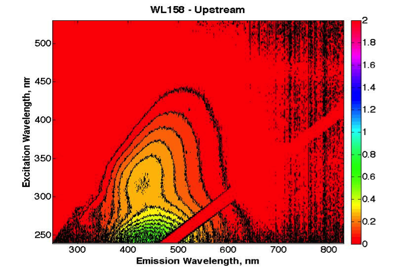
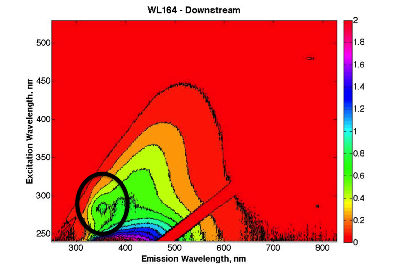

# Introduction - the Waterlogged Project

The Waterlogged project was envisioned as a means of investigation into how human activities affect water quality (specifically, organic matter concentration and composition). The hope of using citizen science would be to serve both educational and community engagement goals, as well as to increase the reach of sampling.

# Context - Traditional Science Methods vs. Citizen Science

- Citizen science is increasingly used as a means of community engagement and education, as well as increasing the scope of research, especially scientific programs involving environmental monitoring.
- Broad definition of ‘citizen science’; in general, “projects in which volunteers partner with scientists to answer real-world questions." (*Rick Bonney*, Busch, 2013).
- Different approaches and definitions to citizen and participatory sciences, parsed broadly into three categories the level of citizen engagement in forming research questions (contributory, collaborative, and co-created projects). 
- Acknowledging the importance of citizen expertises has been identified as essential towards achieving sustainable development, specifically within the context of citizen sciences as a challenge to traditional scientific institutions and actors. (Irwin, 2002)
-	Despite this, much of citizen science within the academic context 'top down'; language of literature around citizen science parsed in terms that values this one directional flow of knowledge from formal scientific institutions, without valuation of knowledge generation occurring outside of traditional scientific institutions and actors. 
- This presents opportunities for different types of knowledge generation, as well as acknowledging unique understandings, motivations and frameworks that participants bring to citizen science involvement.
- This gap is examined by presenting specific lessons learned from a citizen science campaign around water quality monitoring.

# Methods - Waterlogged Project Case Study

The Waterlogged project was designed as a contributing type of citizen science project, in which project aims and directions were designed by scientists for public participation. In the project, participants were told that the aim of the project was to 'investigate how human activities affect water quality, specifically around the concentration and types of organic matter within surface waters like streams and rivers'. Given that organic matter is a less known water quality parameter, information regarding organic matter (what it is, and why it is important to investigate in terms of environmental and human health), was made available through conversation as well as on the project website.

Participants were given sample kits, which consist of acetic acid bathed brown PE bottle in a ziplock bag. This ziplock bag contains a small pencil; attached to the bag is  the protocol for taking a sample, as well as the data sheet to be filled out (both written on waterproof paper.) A freezer pack was also included to keep the sample cool to prevent degradation.

The protocol for taking a sample was designed to be scientifically robust, as well as easy for people to follow. This included criteria for choosing a sample location, which included stipulation that the sample be from streams and rivers, and that it be actively flowing. The importance of safety in choosing a site and taking a sample was also emphasized; participants were told not to enter the water, and to watch for hazards such as slippery, wet surfaces. Prior to taking a sample, participants were told to rinse the bottle at least three times, to sample in a location that had not been disturbed, and to ensure that contamination of the bottle and sample did not occur. Participants were also asked to note critical information about the sample on the sample collection sheet. This included the date and time of collection, the GPS location if possible, and a description of the location and anything within the vicinity that could affect water quality. A sample description was also included to help orient participants. Participants were also asked to take a picture up, down, and across from where the sample was taken to help orient and provide data regarding sample surroundings.

Samples were analyzed for various water quality parameters once the sample was returned to the scientific team. These parameters included total suspended solids (TSS), nitrate concentration (NO3), dissolved organic carbon concentration (DOC), and a range of indices calculated from the absorbency and fluorescence spectra.

- Specific note about the participation of citizen groups already involved within environmental monitoring at specific watersheds around Metro Vancouver - majority (~60%) of samples collected by these organizations, which included several municipalities and volunteer organizations.

#Distribution of Citizen (“WL”) Versus Scientist (“DBP”) Data

Skepticism regarding the quality of data collected by citizens remains a key concern for traditional scientific actors in accepting citizen science projects as adequately rigorous. Given these concerns, we used a paired sampling approach to compare data from samples collected by citizens to that of a pool of samples that scientifically trained individuals collected and analyzed. Because citizen sampling occurred at a range of different sites, we could not fully reproduce the spatial and temporal variability at which citizen sampling occurred. Given this, we attempted with our own sampling to sample sites within the local context that would be popular with sampling, as well as sample a range of sites to provide a snapshot of water quality characteristic of the region. The citizen-data pool comprised some 150 samples, and the our own data comprised some 110 samples.


```{r echo = FALSE, message = FALSE, warning= FALSE}
#The first part of the analysis looks at statistically comparing citizen collected data to our own to answer the question of whether citizen collected data (samples) were the same as those collected by professional scientists (us).
#First step is to retreive both the data from the WL and DBP projects (citizen versus scientist data) into two dataframes. Note all all function scripts are in SpecScript repo (private at this moment). Information regarding data collection and cleaning contained in code in RMarkdown file (suppressed for PDF file).

#WL and DBP data arecompiled in R into two separate dataframes. This includes water quality data such as DOC and NO3 concentrations, as well as quality data associated with DOC quality (spectrophotometric indicies).

#######
# get data for citizen-related data - DOC/NO3/TOC etc
# Use function to get WL data and assemble it into nice dataframe
source("/Users/user/SpecScripts/WLgetdata_function.R")
WLdata <- getWLdata(project = "WL", 
                    spectro.direct = "/Users/user/Dropbox/PhD Work/PhD Data/WL_data/WL_spectrodata", 
                    fppar.directory = "/Users/user/Dropbox/PhD Work/PhD Data/WL_data/WL_spectrodata/WL_fppar", 
                    pathlength = 33)
WLdata <- as.data.frame(WLdata)

# Get data for our own data - from DBP project
source("/Users/user/SpecScripts/DBP_datacompile_function.R")
DBPdata <- getDBPdata(save.directory <- '/Users/user/Dropbox/PhD Work/PhD Data/DBP_data/DBP_analysisdata',
  CM.pre.directory <- "/Users/user/Dropbox/PhD Work/PhD Data/DBP_data/DBP_fluorescence/DBP_prechlorination/DBP_pre_CM_PARAFAC",
  pre.directory <- "/Users/user/Dropbox/PhD Work/PhD Data/DBP_data/DBP_fluorescence/DBP_prechlorination/DBP_prechlor_correctedEEMSRaleigh")
DBPdata <- DBPdata[!rownames(DBPdata) %in% "119", ] #take out null last row

# if the columns are factors, convert to numeric
indx <- sapply(DBPdata, is.factor)
DBPdata[indx] <- lapply(DBPdata[indx], function(x) as.numeric(as.character(x)))

indx <- sapply(WLdata, is.factor)
WLdata[indx] <- lapply(WLdata[indx], function(x) as.numeric(as.character(x)))

# PLot DOC
#WL DOC
#plot(WLdata$DOCcorr, WLdata$NO3.N)
#plot(DBPdata$NPOC_DOC_uncorrected, DBPdata$NO3)
# 99 -102 in DBP are quite high? Something going wrong in the correction phase
# Use uncorrected for now. Only affects DOC measurements from the spectro::lyzer
# Note also that there are Nas within certain of the FI measurements... why?

```


- Figures below show the distribution of DOC and NO3 concentrations for citizen and scientist data. The aim is to investigate how the results from citizens differ from samples collected from 'scientists'.
- Statistical tests (specifically, paired T-testing) were used to determine whether means of citizen versus scientist data for all parameters collected (show in Supplemental Information).

##DOC Concentration - Citizen versus Scientist Data
- Mean DOC concentration between citizen ([DOC] = 3.18 mg/L) and scientist data ([DOC] = 2.94 mg/L) not significantly different (p > 0.05, t-test data in Supplemental Information). 
- Scientist ('DBP') data shows bi-modal distribution of DOC concentrations - low DOC concentrations from streams/ rivers without significant wetland contribution, and higher DOC concentration distribution from samples with a higher degree of wetland within watershed area (specifically, sampling from Gulf Islands).
- Citizen data ('WL') does show the presence of samples with DOC concentrations, noting that the distribution of DOC concentrations for this data pool is 'bumpy' at higher DOC concentrations.

```{r, echo = FALSE, message = FALSE, warning = FALSE}
#required packages
library(tidyr)
library(dplyr)
library(plyr)
library(stringr)
library(stringi)
library(ggplot2)

# convert DOC into the right format for density/histogram plots
varmerge <- function(WLdata_var, DBPdata_var, varname){
  temp <- data.frame(t(cbind(t(WLdata_var), t(DBPdata_var))))
  code <- data.frame(t(cbind(t(WLdata$sample), t(DBPdata$sample))))
  temp$code <- code
  temp$code <- sapply(temp$code, function(x) stri_sub(x, 1, -5)) # get code column such that only "WL or DBp" is in the column
  colnames(temp)[1] <- varname
  return(temp)
}

# Variables to examine
DOC <- varmerge(WLdata$DOCcorr, DBPdata$NPOC_DOC_uncorrected, varname = "DOC_mgL")
NO3 <- varmerge(WLdata$NO3.N, DBPdata$NO3, varname = "NO3mgL")
SUVA <- varmerge(WLdata$SUVA1, DBPdata$SUVA, varname = "SUVA")
e2e3 <- varmerge(WLdata$e2e3, DBPdata$e2e3.dec, varname = "e2e3")
e4e6 <- varmerge(WLdata$e4e6, DBPdata$e4e6.dec, varname = "e4e6")
SR <- varmerge(WLdata$SR, DBPdata$SR.dec, varname = "SR")
FI <- varmerge(WLdata$FI, DBPdata$FI, varname = "FI")
HIX <- varmerge(WLdata$HIX_ohno_area, DBPdata$HIX_ohno_area, varname = "HIX_ohno")
BIX <- varmerge(WLdata$FrI, DBPdata$FrI, varname = "BIX")
peakA <- varmerge(WLdata$peakA, DBPdata$peakA, varname = "peakA")
peakC <- varmerge(WLdata$peakC, DBPdata$peakC, varname = "peakC")
peakB <- varmerge(WLdata$peakB, DBPdata$peakB, varname = "peakB")
peakT <- varmerge(WLdata$peakT, DBPdata$peakT, varname = "peakT")
peakT.C <- varmerge(WLdata$peakt.peakC, DBPdata$peakt.peakC, varname = "peakTC")
redox <- varmerge(WLdata$redox, DBPdata$redox, varname = "redox")
perprotein <- varmerge(WLdata$perprotein, DBPdata$perprotein, varname = "perprotein")

# Do density plots
# http://stackoverflow.com/questions/6939136/how-to-overlay-density-plots-in-r
########### colour blind colour palettes
# The palette with grey:
cbPalette <- c("#999999", "#E69F00", "#56B4E9", "#009E73", "#F0E442", "#0072B2", "#D55E00", "#CC79A7")

# The palette with black:
cbbPalette <- c("#000000", "#E69F00", "#56B4E9", "#009E73", "#F0E442", "#0072B2", "#D55E00", "#CC79A7")

### Default theme
theme = theme_set(theme_bw() + 
                    theme(strip.text = element_text(size=14),
                          axis.text=element_text(size=14, color = "black"), 
                          axis.title = element_text(size=14), legend.text = element_text(size=14),
                          plot.title = element_text(size=14)))

# DOC
DOCplot <- ggplot(DOC, aes(DOC_mgL, fill = code)) + geom_density(alpha = 0.2) +
  scale_fill_manual(values=c(cbPalette[6], cbPalette[2])) +
  geom_vline(aes(xintercept=mean(WLdata$DOCcorr, na.rm=T)),   # Ignore NA values for mean
               color=cbPalette[2], linetype="dashed", size=1) +
  geom_vline(aes(xintercept=mean(DBPdata$NPOC_DOC_uncorrected, na.rm=T)),   # Ignore NA values for mean
               color=cbPalette[6], linetype="dashed", size=1) +
  ggtitle("DOC Concentration")
DOCplot
```


## NO3 Concentration - Citizen versus Scientist Data

- NO3 within scientist-collected data tends to be quite low, noting sharp distribution close to zero (mean [NO3] = 0.16 +/- 0.07 mg/L).
- Mean NO3 significantly greater within the WL data set than the scientist-collected data set (mean [NO3] = 0.44 +/- 0.05 mg/L; p < 0.05, T-test details in Supplemental Data). 
- Citizen NO3 data shows tail towards higher NO3 samples, showing presence of higher NO3 samples within the data set (also shown within cumulative distribution function, shown in Supplemental Information).
- Difference in mean NO3 concentrations could derive either from issues with sample collection, or more likely from the more urban context of sampling within the citizen sampling (noting that significant differences were not observed for DOC is there were issues in sampling). To do: identify urban versus non urban, and look at relationship to NO3 concentration (look for significant linear relationship).

```{r, echo = FALSE, message = FALSE, warning = FALSE}
# NO3
NO3plot <- ggplot(NO3, aes(NO3mgL, fill = code)) + geom_density(alpha = 0.2) +
  scale_fill_manual(values=c(cbPalette[6], cbPalette[2])) +
  geom_vline(aes(xintercept=mean(WLdata$NO3.N, na.rm=T)),   # Ignore NA values for mean
               color=cbPalette[2], linetype="dashed", size=1) +
  geom_vline(aes(xintercept=mean(DBPdata$NO3, na.rm=T)),   # Ignore NA values for mean
               color=cbPalette[6], linetype="dashed", size=1) + 
  ggtitle("NO3 Concentrations")
NO3plot
```

## DOC and NO3 Concentrations
- Below figure shows scatter plot of DOC and NO3 data for both the scientist ("DBP") and citizen ('WL') data sets. 
- Grey lines indicate the mean DOC (y-axis) and NO3 (x-axis) concentrations (noting that this mean is taken across all data sets)
- Specific points related to different lessons learned/outliers within the citizen data shown in orange and yellow in following graphs. Additionally, fluorescence (FI) index also shown, where a FI closer to 2 indicates that the organic matter is from microbes, and a FI closer to 1 indicates that it is more from plant biomass (size of dot corresponds to the FI within specific samples).

```{r, echo = FALSE, message = FALSE, warning = FALSE}
# bind NO3 and DOC together
DN <- cbind(DOC, NO3, SUVA, perprotein, FI)

# Plot as scatter plot to add points
DOCNO3 <- ggplot(DN, aes(x = NO3mgL, y = DOC_mgL, color = code)) + geom_point() +
  scale_color_manual(values=c(cbPalette[6], cbPalette[3])) +
  xlim(0, 3) +
  scale_shape_manual(values=c(5,2)) +
  labs(x = "NO3 (mg/L)",
       y = "DOC (mg/L)",
       title = "DOC versus NO3 Concentration - Scientist and Citizen Data") +
  #geom_point(aes(size = FI)) + 
  #scale_size_continuous(name = FI, range = c(0.5,3))
  geom_vline(aes(xintercept=mean(DN$NO3mgL, na.rm=T)),    # Add mean NO3 for both datasets
               color=cbPalette[1], linetype="dashed", size=1) + 
  geom_hline(aes(yintercept=mean(DN$DOC_mgL, na.rm=T)),   # Add mean DOC for both datasets
               color=cbPalette[1], linetype="dashed", size=1)
# need to deal with NAs in FI...

DOCNO3 
```

# Stories - Outliers and Inliers

Several main themes are explored using the Waterlogged case study.

1. What is an outlier?

2. How do citizens, and citizen-lead community groups, insert their own interests into data collection itself?

3. Contradictory questions that matter to scientists versus citizens (investigating long term trends versus effects of a specific event).

4. Place centrism of data collection for citizens – you can’t possibly meet citizen standards, given their  placement within the context of sampling

5. Data might be primary for scientists, but secondary for citizens whose aim is education.

6. Aberrations that occur but are within normal distribution but are interpreted as more meaningful by citizens due to context of collection.

## Story 1  - Evergreen

**Lesson learned: 5) Data might be primary for scientists, but secondary for citizens whose aim is education**

Sample Description:

- Evergreen is a national environmental not-for-profit whose participation within the Waterlogged project coincides with their  Uncover Your Creeks citizen science project. This program focuses on engagement and education, directly involving citizens in the restoration, rehabilitation and monitoring of streams within the urban Metro Vancouver context.

- Evergreen took dim(ES)[1] samples during the Waterlogged tenure within sites that they use for their Uncover Your Creeks program, including the the Serpentine River, Wagg Creek, Chubb Creek, Still Creek and Jericho Pond (shown as blue dots).

- Samples within the Evergreen subset tended to have higher DOC and NO3 than the average in both the citizen and scientist subsets. This could be attributed to the sample sites in which Evergreen has focused on, noting that they tend to be highly impacted by urban activities (such as the Still Creek and Chubb Creek sites), and thus may have inflows of storm water laden with NO3 and DOC from urban sources. Additionally, the greatest DOC concentrations correspond top samples from the Jericho Pond site, a man-made pond that suffers heavily from eutrophication, especially within the summer months in which sampling occurred.

Lessons Learned:

- In noting that such samples comprised high DOC and NO3, and that this is due to the types of environments that were sampled, we note that such areas are part of educational and restoration work that is part of Evergreen's larger mandate; that integrating the waterlogged methodology within the activities occurring with Evergreen thus resulted in an examination of sites that are heavily impacted by human activities. Additionally, we note that the rational for Evergreen undertaking monitoring projects is firstly educational and capacity building within the community. Data quality and collection is somewhat secondary to these goals, and is somewhat reflected within the quality of sampling (which was reflected within factors such as the amount of data collected on sample sheets, and a number of sample kits that were returned in an incomplete way).


```{r echo = FALSE, message = FALSE, warning = FALSE}
# show points for Evergreen samples in the context of DOC and NO3 histrograms
# Evergreen samples = 46-56, 80-84, 121-124

sample <- c("WL0046", "WL0047", "WL0048", "WL0049", "WL0050", "WL0051", "WL0052",
                                              "WL0053", "WL0054", "WL0055", "WL0056", "WL0080", "WL0081", "WL0083",
                                              "WL0084", "WL0121", "WL0122", "WL0123")
EGsamples <- sample[sample %in% WLdata$sample]
#match samples that have data
ES <- subset(WLdata, WLdata$sample == EGsamples)
ES <- WLdata[which(WLdata$sample %in% EGsamples),]
# plot
DOCNO3 +
  geom_point(data=ES, aes(x=ES$NO3.N, y=ES$DOCcorr, size = FI), colour=cbbPalette[2]) 

```


## Story 2 - Silver Creek Streamkeepers

**Lesson Learned: 2. How do citizens, and citizen-lead community groups, insert their own interests into data collection itself? 6) Aberrations that occur but are within normal distribution but are interpreted as more meaningful by citizens due to context of collection**

Sample Details:

The Silver Creek Streamkeepers are a small monitoring group tasked with monitoring Silver Creek, a small urban stream whose headwaters is located within Burnaby Mountain/SFU;it flows south, through residential areas in its norther reaches and increasingly industrial lands until it flows into the Brunette River, and ultimately Burnaby Lake. The creek is home to various species of fish (including endangered Nooksack Dace, coho and chum salmon and cutthroat trout), and other fauna such as turtles, salamanders, beavers, coyotes and others. The streamkeeper groups is involved in monitoring, as well as restoration and salmon release activities.

Participation within the Waterlogged project was prompted partially out of a desire for increase data regarding water quality in general, as well as concern over a coal train derailment. This derailment occurred in the lower reaches of Silver Creek, just upstream of where the stream enters Burnaby Lake, where Silver Creek emerges from a culvert beneath a Costco parking lot. Three Canadian National (CN) cars tipped into the stream, spilling 270 tonnes of metallurgical coal (a smaller percentage of which entered the stream, according to the Ministry of Environment) on January 11, 2014. It was estimated that this resulted in 5.5 cubic meters of coal in Silver Creek, and 76 cubic meters of coal in downstream Burnaby Lake (noting that heavy rains at the time of the derailment transported a large amount of coal downstream from the derailment). The cause of the derailment was attributed to heavy rains that caused a beaver dam breach upstream of the tracks, causing the stream to overflow tracks close to Brighton Avenue and Government Street in Burnaby, causing seven cars to derail and three cars containing coal to ultimately tip into the stream.

Initially, the ecological impact of the coal spill was estimated to be low, with arising within animals breathing coal sediment through lungs or gills. It was expected that the spill would have with low water quality impacts. However, initial reports regarding the impact of the spill were deemed "deficient in addressing the conditions, environment, biota, and potential concerns in the impacted water bodies,” according to a Ministry of Environment memo dated February 6, 2014 (released on April 16, 2014). At this time, the Ministry requested that CN submit detailed information about the amount of coal spilled and recovered following the accident, and the environmental consequences and fate of the coal remaining in the creek and downstream lake. CN was also required to submit and undertake cleanup and protective measures on the site in an attempt to remediate and protect against future spills; such protective measures included streamside buffers and setbacks, reinforcing stream banks, removing hazardous trees, culvert cleaning, and goals towards protection of downstream water and sediment quality. Remediation and removal of coal within the stream and lake was finished by April 15, 2014, and was primary accomplished by suction dredging , where the presumed coal-water mixture was suctioned through filters to remove coal and sediments, returning filtered water to the stream. After remediation, the company stated that they met provincial cleanup criteria, and that a 'minuscule' amount of coal was left, but could not specify exact figures regarding residual amounts. 

The Silver Creek Streamkeepers took five samples in a transect from stream headwaters to its intersection with the Brunette River in fall, 2014. All of these samples demonstrated higher than average NO3 concentrations (Figure). In addition, the samples upstream of the coal derailment (in blue), had a slightly lower concentration of DOC as compared to samples taken downstream of the derailment (in black). Additionally, we noted the presence of a unique peak within the fluorescence spectra of samples originating downstream of the derailment (in Supplemental Information).

Lessons Learned:

The dominant reason behind participation within the Waterlogged project was to help gain an understanding of how the coal trail derailment had affected the ecosystem (noting that the Municipality of Burnaby suggested their participation knowing of these concerns). Other concerns regarding watershed issues that could affect water quality were also expressed. This included the dominate industrial uses of the watershed itself, significant recent construction just upstream of the derailment and sampling site, deforestation associated with a pipeline assessment, exposed peat within the channel (noting that peat farming was a past land use), and creosote-soaked wooden ties within the stream at the site of the derailment. These interests shaped where samples were taken (noting the transect in which samples were taken), and may shape interpretations of the data itself. Although sites downstream of the derailment site show unique features discussed above, it is nearly impossible to say whether the slight changes in water quality are firstly significant, and secondly derive from the coal train derailment itself. Understanding the impact of derailment within this complex milieu would require a specific research program that would comprise a significantly greater degree of sampling. Additionally, while the methods we used to analyze organic matter composition have been used in a limited way to illuminate possible oil contamination, other analytic approaches (such as determination of hydrocarbon and metal concentrations) would likely be more direct.Thus, because of limitations arising from both sampling as well as a methodology that was not quite tailored to the specific concerns, speculations as to the water quality effects of both the specific spill event, as well as that deriving from watershed conditions, is merely speculation given the data produced within the context of the Waterlogged investigation. Given the expectations and interests brought to sampling, such a conclusion was an unsatisfying conclusion to a compelling story regarding water quality and impacts within our local context.


References (regarding the derailment):
http://www.vancouversun.com/launches+cleanup+coal+dumped+January+derailment+Burnaby/9584019/story.html
http://www.vancouversun.com/Coal+spill+feared+risk+aquatic+life+Burnaby+Silver+Creek/9406236/story.html
http://www.straight.com/news/629231/cn-report-burnaby-coal-derailment-deficient-lacks-details-environmental-impacts
http://www.burnabynow.com/news/cn-finishes-coal-spill-cleanup-1.963761#sthash.1w2efbBC.dpuf

```{r echo = FALSE, message = FALSE, warning = FALSE}
# Silver creek streamkeepers
# Prior to derailment: 157, 158, 165
# Down = 27, 164

up <- c("WL0157", "WL0158", "WL0165")
down <- c("WL0027", "WL0164")
all <- c("WL0157", "WL0158", "WL0165", "WL0027", "WL0164")

#match samples that have data
up <- WLdata[which(WLdata$sample %in% up),]
down <- WLdata[which(WLdata$sample %in% down),]

DOCNO3 +
  geom_point(data=up, aes(x=up$NO3.N, y=up$DOCcorr, size = FI), colour=cbbPalette[2]) +
  geom_point(data=down, aes(x=NO3.N, y=DOCcorr, size = FI), colour=cbbPalette[7]) 
```


## Story 3 - Bowen Island Municipality

**Lesson Learned: 2) How citizens insert their own interests into data collection itself; 3. Contradictory questions that matter to scientists versus citizens (investigating long term trends versus effects of a specific event).**

Sample Description:

Staff from the Municipality of Bowen Island were interested in participating within Waterlogged given concerns over the effect that possibly leaking septic fields were having on a stream-fed lagoon. This area has seen much recent development of residential homes around the lagoon itself without the development of an expensive wastewater system; thus, new and existing developments use septic systems. Municipal staff were concerned about the aggregate effects of possible septic contamination into the lagoon, and were interested in any preliminary water quality data that could help determine whether more intensive study of the site is necessary.

Municipal staff took four total samples in fall of 2015. One sample was taken in the stream entering the lagoon, prior to residential development, and was thus considered by the samplers to be a control. This 'control' showed lower concentrations of both NO3 and DOC when compared to the lagoon samples. In particular, a sample taken at the north side of the lagoon (considered to be a likely candidate by the participants for septic contamination) did demonstrate the highest NO3 concentrations of an sample within the sample set. This sample also had high levels of TSS (dark filter shown in Supplemental Information). 

Lessons Learned:

Although sewage contamination can increase NO3 concentrations, other factors, such as fertilizers from lawns and gardens, can also increase concentrations. A more direct way of testing for septic field infiltration would be bacterial testing to test for the presence of fecal coliforms. Thus, participation within the project lent some gravity to concerns about septic field contamination, with the provision that the specific question posed by the municipality would be best answered using other analytic methods and a more in-depth sampling regime.

Thus, while the Waterlogged project can suggest that this sample might be affected by septic field contamination, the definitive presence of fecal coliforms (which would pinpoint such contamination), is beyond the ability of this type of analysis to determine. This speaks to the difficulty of reconciling the motivations that citizens bring to sampling, as well as the fact that questions that matter to citizens may differ from those the scientist sets out to examine.

```{r echo = FALSE, message = FALSE, warning = FALSE}
# Bowen creek samples 218-221. 221 = control
BI <- c("WL0218", "WL0219", "WL0220", "WL0221")
BIs <- WLdata[which(WLdata$sample %in% BI),]

DOCNO3 +
  geom_point(data=BIs, aes(x=NO3.N, y=DOCcorr, size = FI), colour=cbbPalette[7]) +
  geom_point(data=BIs[4,], aes(x=NO3.N, y=DOCcorr, size = FI), colour=cbbPalette[2]) 
```

## Story 4 - North Shore Wetland Partners

**Lesson Learned: 2) How citizens insert their own interests into data collection itself; 6) Aberrations that occur but are within normal distribution but are interpreted as more meaningful by citizens due to context of collection**
 
 Sample Description:
 
 The North Shore Wetland Partners is a volunteer run community organization founded in 2004 and incorporated in 2010 whose mandate is "to promote conservation of North Shore wetlands through education, research, restoration and stewardship." Their interest in participating within Waterlogged was to augment water quality and ecosystem monitoring and restoration activities they undertake throughout Vancouver's North Shore, focused somewhat on natural and man-made wetlands, but also ecological health of aquatic systems generally (including the Seymour River). 
 
 The NSWP took some 12 samples from sample sites across that North Shore that, to the best of our knowledge, comprise their own research and sample sites. From the Waterlogged data, 9 out of 12 samples exhibited higher than average DOC concentrations, and eight out of 12 sites showed higher than average NO3 concentrations. 
 
 Lessons Learned:
 
 In addition to concerns about urbanization within watersheds sampled, the NWSP expressed concerns to us that one site in particular had been affected by clear cutting (which occurred in the late 2000s) which they considered to be illegal. They expressed concerns through returned data sheets that samples taken within the vicinity of this activity suffered from unusually high concentrations of iron (indeed, in certain instances the sample data sheet was stained with the characteristic orange colour of iron oxides). Given that iron analysis of beyond the scope of the work, we could not assess in a quantitative way whether iron was particularly high in these (or any) samples. Additionally, we note that iron can be characteristic of the iron-rich podzol that dominates much of the local soils, where it would be difficult to link any loss of forest cover to increased iron. However, we also note that high concentrations of iron gives streams and rocks a vivid orange hue; because the NSWP knows the historical precedence of the watershed, this could serve as a dramatic visual cue that water quality is impaired within a context in which they are aware that disruption has taken place.
 
```{r echo = FALSE, message = FALSE, warning = FALSE}
# North Shore Wetland Partners
BI <- c("WL0090", "WL0091", "WL0092", "WL0093", "WL0094", "WL0061", "WL0062", "WL0063", "WL0064", "WL0065",
       "WL0067", "WL0068", "WL0069", "WL0093", "WL0094")
BIs <- WLdata[which(WLdata$sample %in% BI),]

DOCNO3 +
  geom_point(data=BIs, aes(x=NO3.N, y=DOCcorr, size = FI), colour=cbbPalette[2]) +
  geom_point(data=BIs[6,], aes(x=NO3.N, y=DOCcorr, size = FI), colour=cbbPalette[7]) 
 
# make size of dot scorrespond to the SUVA?
#geom_point(aes(size=NO3)) - put in percent protein?

```

## Story 5 - North Shore Streamkeepers (Pacific Streamkeepers Federation)
**Lesson Learned: 1) What is an outlier?; 4) Place centrism of data collection for citizensm**

Sample Description:

The North Shore Streamkeeprs, a streamkeeping group central to the operation of the Pacific Streamkeepers Organization, monitors the health of several watersheds around North Vancouver. They are a unique organization in that they have developed (in collaboration with the Department of Fisheries and Oceans) a in-depth scientific protocol for monitoring that has been adopted by numerous local streamkeeping group. They extensive volunteer activities are coordinated by an exceptional community leader within the organization. This group expressed concerns about urbanization effects in general (especially on fish-bearing streams), as well as previous study they conduction which showed that sewage contamination can occur within their sampling sites due to improperly or illegally connected sewer systems from houses. 

Samples from this organization tended to have lower than average DOC concentrations, but be slightly elevated in NO3 when compared to the rest of the data. 

Lessons Learned:

What is striking about samples from this organization is the presence of a high DOC concentration sample, noted in red in the figure below. This sample was taken from Hastings Creek, downstream of a construction site. The person sampling is highly involved in watershed activities within the North Shore, and noted a large sediment plume originating from a culvert leading from the construction site. This on the ground timeliness allowed the individual to take an immediate sample. Upon analysis, we noted that the sample was opaque with sediment, much of which persisted despite filtering with a 70 micron filter. Because of the nature of our optical-based measurement of DOC, this fine suspended sediment contributed to a DOC concentration measurement of 13.67 mg/L - the fourth highest DOC measurement across all data (an inflated number based on the interference of the sediment present). Thus, the capacity of citizen samplers, especially the community champions who are actively involved, can provide samples and data regarding events that would occur at a timescale that would be difficult for others to capture, given the need to realize the issue, gather equipment, and get to the site. This sample also questions the concept of an outlier within the context of the data sampled- as noted, this sample is one of the highest DOC concentrations noted due to interference. However, contextual data about the circumstances of sampling contextualizes what could otherwise be considered a poor or overinflated data point. 


Pacific Streamkeepers Links:
-Taccogna, G. and K. Munro (eds). 1995. The Streamkeepers Handbook: a Practical Guide to Stream and Wetland Care. Salmonid Enhancement Program, Dept. Fisheries and Oceans, Vancouver, BC.
- http://www.pskf.ca/publications/Handbook%20and%20Modules.pdf

```{r echo = FALSE, message = FALSE, warning = FALSE}
# North Shore and Zo Ann sampples. High DOC 186
BI <- c("WL0036", "WL0038","WL0058",  "WL0074", "WL0075", "WL0076", "WL0077", "WL0078", "WL0079", 
        "WL0179", "WL0180", "WL0181", "WL0182", "WL0183", "WL0184", "WL0185", "WL0186", "WL0187", "WL0188" )
BIs <- WLdata[which(WLdata$sample %in% BI),] 

DOCNO3 +
  geom_point(data=BIs, aes(x = BIs$NO3.N, y = DOCcorr, size = FI), colour = cbbPalette[2]) +
  geom_point(data=BIs[8,], aes(x = NO3.N, y = DOCcorr), colour = cbbPalette[7], size = 3) 

```


## Story 6:  Sample from Mt Polley Mining Disaster
**Lesson Learned: 1) What is an outlier? 2) How citizens insert their own interests into data collection itself; 3) Contradictory questions that matter to scientists versus citizens (investigating long term trends versus effects of a specific event).**

Sample Description:

The sample taken the furthest outside of the Metro Vancouver region corresponded to a sample taken on the Quesnel River, taken three days after a major dam breech spilled mine effluent into the Quesnel Lake and River. A drinking water ban was immediately placed on these water sources, though subsequent water quality testing would show that water was acceptable in terms of provincial drinking water guidelines (noting that elevated concentrations of metals including selenium, arsenic, copper, and vanadium were found within sediment, with unknown long term environmental effects within affected environments).

From the description taken by the person sampling: *"Dock near boats. summertime. Clear morning around 24degC. Three days after major environmental disaster at Polley Mountain Mine. Lake and surrounding water ways have floating debris + government water ban."*

Data from this single sample was not remarkable in either DOC or NO3 concentrations - indeed, the sample showed lower than average DOC and NO3 concentrations.  

Lessons Learned:

This sample again speaks to the motivations that underlie intentions to sample. In this case, the occurrence of a major, well publicized event spurred the participant to take a sample, despite the incompatibility of our research goal and correspondent method at investigating the likely effects on water quality from this major event. 

This sample also showcases that water quality is a matter of lenses, speaking also to the question of what is an outlier. This sample is clearly not an outlier by measure of either sample set; yet, this watershed had clearly  experienced an event that mine safety experts have called one of the largest in Canadian history (noting that the sample was taken only three days after the mine dam breached). In this case, this exceptional sample shows simply as an ‘in-lier' within the data distribution, belying the circumstances under which it was collected.

```{r echo = FALSE, message = FALSE, warning = FALSE}
# Mt Polley Spill
BI <- c("WL0040")
BIs <- WLdata[which(WLdata$sample %in% BI),] 

DOCNO3 +
  geom_point(data=BIs, aes(x=BIs$NO3.N, y=BIs$DOCcorr, size = FI), colour = cbbPalette[2]) 

```

## Story 7: Lawson Creek Fish Kill 
**Lesson Learned: Community sampling as a response to a specific event; Limits of methodology; Difficulty of determining effects from specific events or conditions within generalized science plan; Sophistication of community resources and existing activities**

Sample Description:

Lawson Creek is a small urban creek that runs from Cypress Mountain south to the Burrard Inlet, through highly residential areas and a man-made wetland. Both the Pacific Wetland Partners and the West Vancouver Streamkeepers have been involved within long term monitoring, restoration, and fish release within the creek.

In addition to general concerns regarding consequences of urban development on ecological health within this watershed, both groups have undertaken an environmental assessment to explain why a large percentage of released fish died. This fish kill was attributed to stress during transport; the streamkeeping groups expressed doubt as to whether transport stress killed the fish, as they died several weeks after introduction, but could not otherwise attribute the deaths based on the water quality monitoring they had done. In their words,"I think we just don’t know why the fish were killed.""

In terms of water quality parameters observed through Waterlogged participation, five total samples were taken lower in the reach of the stream, where most of the monitoring activities have to date taken place. None of the samples were remarkable in terms of their DOC or NO3 concentrations, noting that neither would have toxic effects to the fish at high concentrations. 

Lessons Learned:

Both the sampling for our project, as well as subsequent sampling occurring after the fish mortality event, speaks to the nature of all grab and point sampling as a snapshot in time. Even with the increased capacity of citizens to reach and sample a location within their local context, it is possible that if the fish deaths were related to a water quality issue, the timescale at which this even may have occurred may have been too short to sample. Thus, it is impossible to completely rule out the occurrence of a short-time period water quality event that contributed to fish mortality, despite the effort and resources dedicated to testing that showed unremarkable results for a range of water quality metrics. Because the citizens monitoring the stream have the ability to mobilize sampling at a much shorter time period than professional scientists, what does this say about our ability to investigate destructive events that occur at short time periods, especially ones occurring within locations more remote than an easily accessed urban stream?


```{r echo = FALSE, message = FALSE, warning = FALSE}
# Lawson Creek Samples
#66, 67 - PWP
#102, 110, 130 - West Van Streamkeepers
BI <- c("WL0066", "WL0067", "WL0102", "WL0110", "WL0130")
BIs <- WLdata[which(WLdata$sample %in% BI),] 

DOCNO3 +
  geom_point(data=BIs, aes(x=BIs$NO3.N, y=BIs$DOCcorr, size = FI), colour = cbbPalette[2]) 
# missing 66?
```

## Story 8 Byrne Creek Streamkeepers
- effect of urbanization on stream.
- Took transect of samples around Byrne Creek in Burnaby - highly impacted by urbanziation.
- Lesson about imposing own values on sampling - difficult to tell effects given small geographic reach of transect.
- skip for now?

```{r echo = FALSE, message = FALSE, warning = FALSE}
# Byrne Creek = Paul C and 
BI <- c("WL0155", "WL0193", "WL0194","WL0195","WL0197","WL0200")
BIs <- WLdata[which(WLdata$sample %in% BI),] 

DOCNO3 +
  geom_point(data=BIs, aes(x=BIs$NO3.N, y=BIs$DOCcorr, size = FI), colour=cbbPalette[2]) 

```


# Other themes:

- Lack of current water quality assessment from actors such as different levels of government. Lack of resourcing around water quality assessment in general, noting participation of several municipalities, and water quality groups closely associated with municipal governments. Also, that monitoring, assessment and remediation of watersheds within this context shouldered by community groups with limited resource (run by committed volunteers and small staff). 
- That community level activities can in certain cases be quite sophisticated, despite limited resourcing and predominately volunteer composition.
- Significant capacity can exist within the community context, including groups and individuals with extensive knowledge regarding the history and conditions of a specific watershed. In certain cases, this can also include sophisticated long term monitoring studies.
 - Importance of a champion within organizations. 
 - Concerns are very specific to context - in this case, was difficult to see generalization concerns across the community groups participating within Waterlogged, despite close context, geographically as well as in terms of urban area. Means that co-creation of a relevant research question and accompanying methodology would be difficult to make generalization across different contexts.
- Methodology chosen within this context seemed tailored to citizen science, given that spectrophotometric methods (absorbance and fluorescence) are high throughput (fast and simple to perform), and have a very low cost per sample. Simplicity of the operational methodology belies the complexity of information gained from these techniques - specifically, the wide range of indices calculated from these measurements that describes the types of organic matter within a sample. Difficult to explain what these indices mean in a simple way, and also difficult to contextualize data in a way that would be meaningful and relevant for participants.
- Community sampling/concerns were typically  a response to a specific event.

# Supplemental Information and Statistical Tests
## Plotting Citizen Data Versus Scientist Data
To look at the difference between citizen data and our own, we use histograms and cumulative distribution functions to look at density of data within both data sets around mean values.

Expressed as histograms, with our data in one and the citizen data in another (for DOC concentrations only):
```{r echo = FALSE, message = FALSE, warning = FALSE}
# plot the two in histograms
library(ggplot2)
#http://www.r-bloggers.com/how-to-make-a-histogram-with-ggplot2/

ggplot(data=DBPdata, aes(DBPdata$NPOC_DOC_uncorrected)) +
  geom_histogram(aes(y =..density..),
                 breaks=seq(0, 30, by = 2),
                 col="black",
                 fill="red",
                 alpha = .2) +
  geom_density(col="red") +
  labs(title="Our Data - [DOC]") +
  labs(x="DOC (mg/L)", y="Count") +
  geom_vline(aes(xintercept=mean(DBPdata$NPOC_DOC_uncorrected, na.rm=T)),   # Ignore NA values for mean
               color="red", linetype="dashed", size=1)

ggplot(data=WLdata, aes(WLdata$DOCcorr)) +
  geom_histogram(aes(y =..density..),
                 breaks=seq(0, 30, by = 2),
                 col="black",
                 fill="blue",
                 alpha = .2) +
  geom_density(col="blue") +
  labs(title="Citizen Data - [DOC]") +
  labs(x="DOC (mg/L)", y="Count") +
  geom_vline(aes(xintercept=mean(WLdata$DOCcorr, na.rm=T)),   # Ignore NA values for mean
               color="blue", linetype="dashed", size=1)

```

Lastly, can also look at the cumulative distribution function to see shifts in the data between the two sets. See the evidence of a 'tail' in the WL data, showing contribution of higher DOC samples.

```{r echo = FALSE, message = FALSE, warning = FALSE}
#now make your lovely plot - CDF
# https://r-dir.com/blog/2014/03/cdfs-in-r.html
# http://stackoverflow.com/questions/6989015/ecdf-on-the-same-plot-using-ggplot2

ggplot(DOC, aes(x = DOC_mgL)) + 
   stat_ecdf(aes(group = code, colour = code)) 

```


## Statistical tests - is citizen data different from scientist collected data?
The first statistical test for significant differences is a t-test to look at whether means are significantly different between the two groups. 

```{r, echo = FALSE, warning = FALSE}
# Statistical test for significant differences
# T-tests
t.test(DOC_mgL ~ code, data = DOC)
ggplot(DOC, aes(x=code, y=DOC_mgL, fill=code)) + geom_boxplot()

t.test(NO3mgL ~ code, data = NO3)
ggplot(NO3, aes(x=code, y=NO3mgL, fill=code)) + geom_boxplot()

t.test(e2e3 ~ code, data = e2e3)
ggplot(e2e3, aes(x=code, y=e2e3, fill=code)) + geom_boxplot()

t.test(e4e6 ~ code, data = e4e6)
ggplot(e4e6, aes(x=code, y=e4e6, fill=code)) + geom_boxplot()

t.test(FI ~ code, data = FI)
ggplot(FI, aes(x=code, y=FI, fill=code)) + geom_boxplot()

t.test(HIX_ohno ~ code, data = HIX)
ggplot(HIX, aes(x=code, y=HIX_ohno, fill=code)) + geom_boxplot()

t.test(BIX ~ code, data = BIX)
ggplot(BIX, aes(x=code, y=BIX, fill=code)) + geom_boxplot()

t.test(peakA ~ code, data = peakA)
ggplot(peakA, aes(x=code, y=peakA, fill=code)) + geom_boxplot()

t.test(peakC ~ code, data = peakC)
ggplot(peakC, aes(x=code, y=peakC, fill=code)) + geom_boxplot()

t.test(peakT ~ code, data = peakT)
ggplot(peakT, aes(x=code, y=peakT, fill=code)) + geom_boxplot()

t.test(peakB ~ code, data = peakB)
ggplot(peakB, aes(x=code, y=peakB, fill=code)) + geom_boxplot()

t.test(redox ~ code, data = redox)
ggplot(redox, aes(x=code, y=redox, fill=code)) + geom_boxplot()

t.test(perprotein ~ code, data = perprotein)
ggplot(perprotein, aes(x=code, y=perprotein, fill=code)) + geom_boxplot()

```

## Bowen Island Samples - Filter 
Shown are the filters after sampling the Bowen Island samples. On the far left is the 'control' sample; the sample with high NO3 corresponds to the filter with the greatest amount of sediment (middle right filter).


## Fluorescence Spectra from Coal Deraillment





